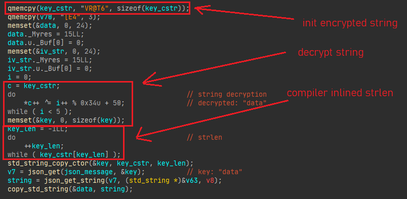
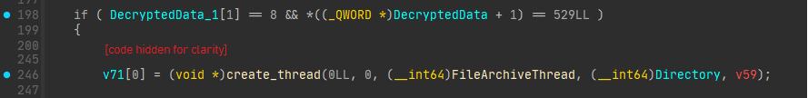
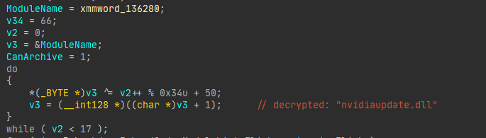
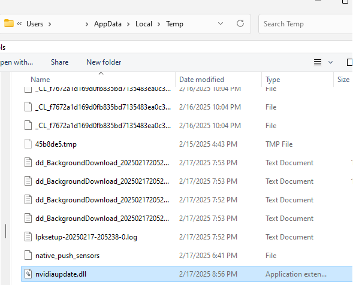
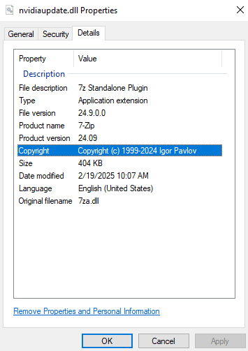
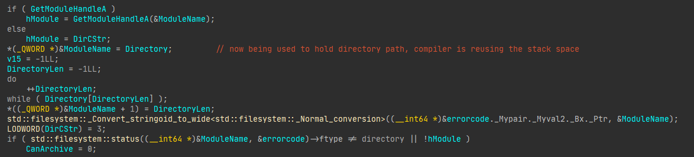
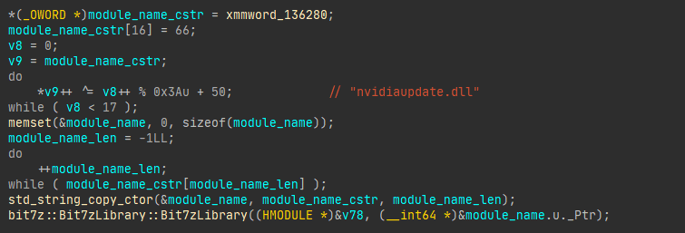
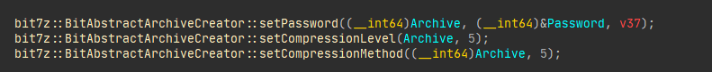
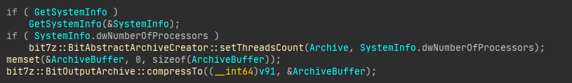

## Introduction
This is a more technical follow up to the discord announcement regarding the malware that was recently disovered in Project Retrac's client-side anticheat.
It provides proof to backup our arguments, even though Retrac staff themselves have already (somewhat) admitted it.

I have uploaded the malicious dll in case you wanted to analyze it yourself, as well as a legitimate one for reference, which was pushed to production the next day. They are each named after their usage dates:\
`bin/02-17-25.dll` is the malicious dll\
`bin/02-18-25.dll` is the legitimate dll

## Analysis

### File Sizes
First, we can compare the file sizes:
```bash
$ ls ./bin -l --block-size=KB | awk '{print $5, $9}'

10798kB 02-17-25.dll
9483kB 02-18-25.dll
```
As you can see, the malicious dll is roughly 1.3MB larger. However, this can be due to legitimate reasons. (In this case it most likely isn't)

### Static analysis
I have labeled the string decryption in the first image as it repeats many times throughout this analysis.
\
Here, they are retrieving `data` from the websocket response from the server.

A bit further down, they decrypt `data` using [Crypto++](https://github.com/weidai11/cryptopp).

Then, depending on what the data is, they create another thread to archive the files in the background. They pass in `Directory`, which is a string retrieved from the decrypted data. This means that **the server** controls what to archive and send back.\


In this thread, they decrypt another string:\


Maybe looking up this dll name might give us a clue as to what it is.\


Not even google knows what this "nvidiaupdate.dll" is. Luckily, searching for this file on the victim's disk yields a result.\


Let's also take a look at the file details.\


Igor Pavlov?? 7-Zip?? This dll doesn't seem related to Nvidia in any way. That's because it's not. The name was used to obscure the fact that 7-Zip is running in the game process. You can even see the original filename: `7za.dll`.

The module name is then passed into [GetModuleHandleA](https://learn.microsoft.com/en-us/windows/win32/api/libloaderapi/nf-libloaderapi-getmodulehandlea) in order to make sure that it is indeed loaded. Another sanity check makes sure that the directory is in fact a directory.\


If these checks succeed, they call a function to recursively archive all files in the directory. This function starts by decrypting the same module name that we saw earlier. It then gets passed to the `Bit7zLibrary` constructor from the [bit7z](https://github.com/rikyoz/bit7z) library. I retrieved some library function names using Hex-Rays' [FLIRT](https://docs.hex-rays.com/user-guide/signatures/flirt).\


They then use [std::filesystem::recursive_directory_iterator](https://en.cppreference.com/w/cpp/filesystem/recursive_directory_iterator) to iterate over all files in the directory, and add them to the archive using `bit7z::BitOutputArchive::addFile`

> **_NOTE:_** This is likely done by the library itself, as shown in their README:
```cpp
#include <bit7z/bitarchivewriter.hpp>

try { // bit7z classes can throw BitException objects
    using namespace bit7z;

    Bit7zLibrary lib{ "7z.dll" };
    BitArchiveWriter archive{ lib, BitFormat::SevenZip };

    // Adding the items to be compressed (no compression is performed here)
    archive.addFile( "path/to/file.txt" );
    archive.addDirectory( "path/to/dir/" );

    // Compressing the added items to the output archive
    archive.compressTo( "output.7z" );
} catch ( const bit7z::BitException& ex ) { /* Do something with ex.what()...*/ }
```

They then use Crypto++ to come up with a password for the archive, and set the password, along with the compression level and compression method.\


Next, then use [GetSystemInfo](https://learn.microsoft.com/en-us/windows/win32/api/sysinfoapi/nf-sysinfoapi-getsysteminfo) to obtain the number of cpu cores are available, and use that many threads in order to speed up compression. Finally, they begin compressing the archive to a buffer.


The archive buffer is then moved to the buffer pointed to by the first parameter in this function.

Once the function returns, they do something with the buffer, likely send it over to the server. I can't tell exactly what it does as the function has been virtualized.